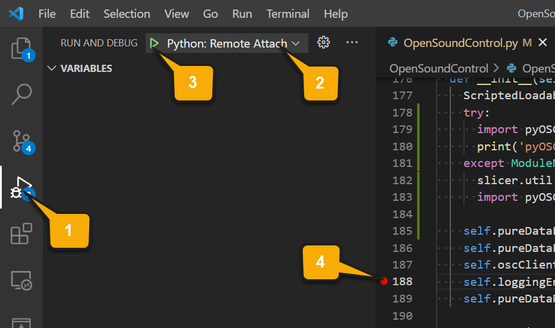

# DebuggingTools extension for 3D Slicer
Extension for 3D Slicer containing various tools for module development and debugging.

Included modules:
- Python Debugger (in category: Developer Tools): Visual debugging (setting breakpoints, execute code step-by-step, view variables, stack, etc.) of Python scripts in Slicer using PyCharm, Visual Studio Code, Eclipse, etc.
- Node modified statistics (in category: Developer Tools): Module for collecting statistics on timing of node Modified events. It is useful for estimating refresh rate when a live data stream or temporal data sequence is visualized.
- Node info: Browse nodes in the Slicer scene, find referenced and referencing nodes, create dockable widgets to display content of selected nodes.

Authors: Andras Lasso (PerkLab, Queen's University),  Mikael Brudfors ([Laboratorio de Imagen Medica, Hospital Gregorio Maranon](http://image.hggm.es/)).

## Python Debugger


Python debuggers:
- PyCharm: Easiest to set up and most convenient (due to availability of automatic reconnect at startup). Requires professional version, which is only free for academic users.
- Visual Studio Code: A bit less convenient to use and more complicated to set up.
- Eclipse: Has less features than other editors and not as convenient, but has the unique feature of being able to jump to any line within the current function.

### Instructions for PyCharm

#### One-time setup

- Install Professional Edition of [PyCharm]](https://www.jetbrains.com/pycharm/download/). Professional version is avaialable for anybody with an academic email address for free. Free Community edition will not work, as it does not include remote debug server.
- In PyCharm:
  - In the menu select: `Run` / `Edit configurations`
  - Click the small + icon in the top-left (Add new configuration)
  - Select `Python remote debug configuration` or `Python debug server` as template
  - Set Name: `Slicer remote debugger`
  - Set Port: `5678`
  - Click OK
- In Slicer:
  - Install the `DebuggingTools` extension
  - Open the `Python debugger` module (in `Developer Tools` category)
  - In the `Settings` section select debugger: `PyCharm`
  - If `pycharm-debug.egg` path is not detected automatically then set the path with the selector (it is usually in the `debug-eggs` subfolder of the PyCharm installation)

#### Start debugging
- In PyCharm:
  - In the menu select: `Run` / `Debug`, click `Slicer remote debugger`
- In Slicer:
  - Open the `Python debugger` module (in `Developer Tools` category)
  - Click on `Connect` button. Slicer will become unresponsive until the debugger is attached.
- In PyCharm:
  - Load your .py file and add breakpoints (menu: `Run` / `Toggle Line Breakpoint`) where you want your execution to stop for debugging.
  - **Important: once Slicer is paused at a breakpoint, you can open a terminal**, where you can enter Python commands. In that terminal you have access to all Slicer variables, it has auto-complete, etc. Click the small terminal icon `Show Python Prompt` to open the Python terminal.


##### Troubleshooting

###### Connection refused

If attaching the debugger with "Connection refused" error message then:
- Make sure the debug server is started. It is indicated by PyCharm should displaying this message `Starting debug server at port 5678 ... Waiting for process connection`
- On Linux, make sure the 5678 port is enabled on the firewall by this command: `sudo ufw allow 5678`

### Instructions for Visual Studio Code

#### One-time setup

- Install [Visual Studio Code](https://code.visualstudio.com/) (free, available on Windows, Linux, and Mac)
- Install `Python` extension by Microsoft
- Start Visual Studio Code and set up remote debugger connection to Slicer:
  - Open a folder that contains your Python files by selecting in menu: File / Open folder
  - Open a Python file
  - Select in menu: Run / Add configuration
  - Choose "Remote attach", use `localhost` for host name, and `5678` for port number 
  - Visual Studio should show `launch.json` file that contains a `Python: Remote Attach` entry in `configurations` element. Remove `pathMappings` section (otherwise the debugger with fail to add breakpoints with the message `pydev debugger: warning: try to add breakpoint to file that does not exist`). The resulting launch.json file should look something like this:

```
{
    // Use IntelliSense to learn about possible attributes.
    // Hover to view descriptions of existing attributes.
    // For more information, visit: https://go.microsoft.com/fwlink/?linkid=830387
    "version": "0.2.0",
    "configurations": [
        {
            "name": "Python: Remote Attach",
            "type": "python",
            "request": "attach",
            "port": 5678,
            "host": "localhost"
        }
    ]
}
```

  - Click the "Run and debug" icon in the left side of the screen (see `1` in the screenshot below)
  - Choose `Python: Remote Attach` configuration at the top of the debug panel (see `2` in the screenshot below). Do not click the green button yet (`3` in the screenshot below): connection will fail because the connection has not been initiated in Slicer yet.




- In Slicer:
  - Install the Python debugger extension
  - Open the `Python debugger` module (in `Developer Tools` category)
  - In `Settings` section select debugger: `VisualStudio Code`

#### Start debugging
- In Slicer:
  - Open the `Python debugger` module (in `Developer Tools` category)
  - Click on `Connect` button. Slicer will become unresponsive until the debugger is attached.
- In Visual Studio Code:
  - Click debugger icon on the left side of the screen (see `1` in the screenshot above)
  - Click `Start debugging` button (green triangle, see `3` in the screenshot above)
  - Add a breakpoint to the Python file where you want to start debugging by clicking slightly to the left from the line number (a red dot will appear there, see `4` in the screenshot above)

### Instructions for Eclipse

#### One-time setup
- Install Eclipse with PyDev: the simplest is to use the standalone preconfigured [LiClipse](https://www.liclipse.com) package.
- Run PyDev and enable the remote debugger tool (if you have trouble following these steps then you can find detailed instructions [here](https://www.pydev.org/manual_adv_remote_debugger.html).
  - Enable PyDev server: in the menu `Window` > `Customize perspective` > `Command groups availability` > `PyDev debug`
  - Open the debug window: in the menu `Window` > `Open Perspective` > `Other` > `Debug` => **Without this step the `Resume` button will be disabled and debugging cannot be started!**
- In Slicer:
  - Install the Python debugger extension
  - Open the `Python debugger` module (in `Developer Tools` category)
  - In the `Settings` section set the directory that contains the `pydevd.py` file. Usually it is in the Eclipse plugins directory `/...pydev.../pysrc`.

#### Start debugging
- In PyDev
  - Start the server: on the toolbar click the button "PyDev: start the pydev server"


- In Slicer:
  - Open the `Python debugger` module (in `Developer Tools` category)
  - Click on `Connect`
  - If the debugger is successfully attached, then it will pause Slicer, so Slicer becomes unresponsive (until its execution is resumed in PyDev)
- In PyDev:
  - Slicer execution is now paused. Slicer will become unresponsive until the debugger is attached.
  - Load your .py file into PyDev and add breakpoints (Ctrl+Shift+B) where you want your execution to stop for debugging.
  - Important: you can open a terminal, where you can enter Python commands while the execution is paused (you have access to all Slicer variable, it has auto-complete, etc.) by clicking on `Open Console` (small button at the top of the console view) then chose `PyDev Console` and then `PyDev Debug Console` (after this the title of the console should be `PyDev Debug Console` instead of the default `Debug Server`).

### Instructions for Visual Studio

#### One-time setup
- Install Visual Studio.
- If using Visual Studio 2013 or 2015: install [https://github.com/Microsoft/PTVS/releases/v2.2.2 Python Tools for Visual Studio]
- If using Visual Studio 2017 or later: install Python native development tools by following the steps below
  - Open Visual Studio Installer by selecting `Tools` menu / `Get Tools and Features...`
  - Make sure the checkbox is checked for `Python development` (in `Web & Cloud` category)
  - In `Summary` section in the right, make sure `Python native development tools` checkbox is checked
- In Slicer:
  - Install the Python debugger extension
  - Open the `Python debugger` module (in `Developer Tools` category)
  - In the `Settings` section select debugger: `VisualStudio`

#### Start debugging
- In Slicer:
  - Open the `Python debugger` module (in `Developer Tools` category)
  - Click on `Connect` button. Slicer will become unresponsive until the debugger is attached.
- In Visual Studio 2013/2015:
  - In menu, select `Debug > Attach to Process` to display the `Attach to Process` window
  - `Transport` -> `Python remote (ptvsd)`
  - `Qualifier` -> `tcp://slicer@localhost:5678`
  - Press Enter (or click `Refresh` button). The Slicer process should appear in the list below.
  - Press Enter (or click `Attach` button). The popup window in Slicer should disappear.
- In Visual Studio 2017:
  - In menu, select `Debug > Attach to Process` to display the `Attach to Process` window
  - `Connection type` -> `Python remote (ptvsd)`
  - `Connection target` -> `tcp://slicer@localhost:5678`
  - Press Enter (or click `Refresh` button). The Slicer process should appear in the list below.
  - Press Enter (or click `Attach` button). The popup window in Slicer should disappear.
  - For connecting again, `Debug` / `Reattach to Process` function can be used
- In Visual Studio 2019 or later:
  - In menu, select `Debug > Attach to Process` to display the `Attach to Process` window
  - `Attach to` -> `Python code`
  - `Process` -> `SlicerApp-real.exe`
  - Press Enter (or click `Attach` button). The popup window in Slicer should disappear.
  - For connecting again, `Debug > Reattach to Process` function can be used
